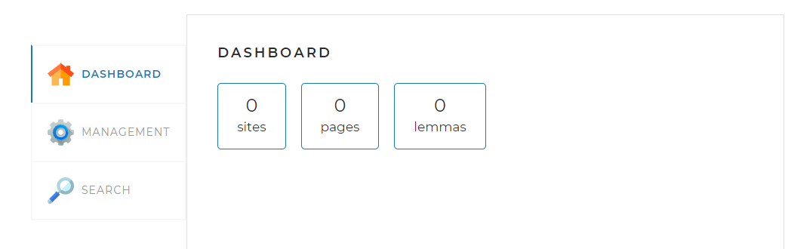
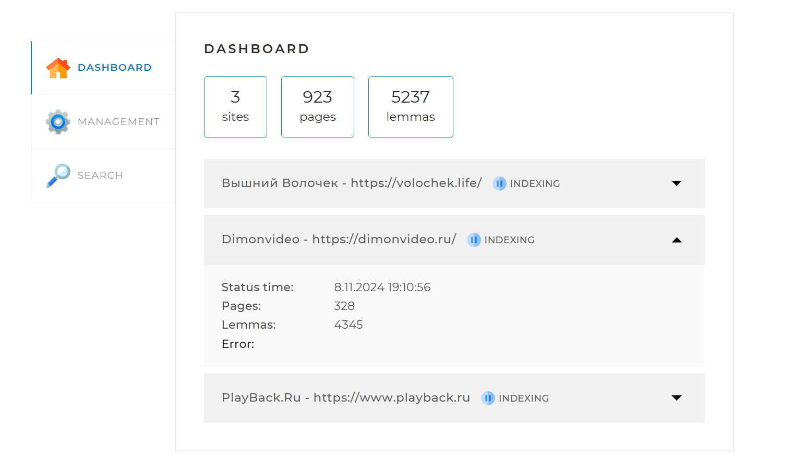
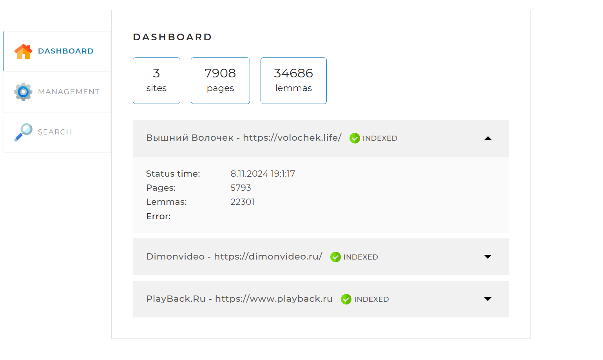
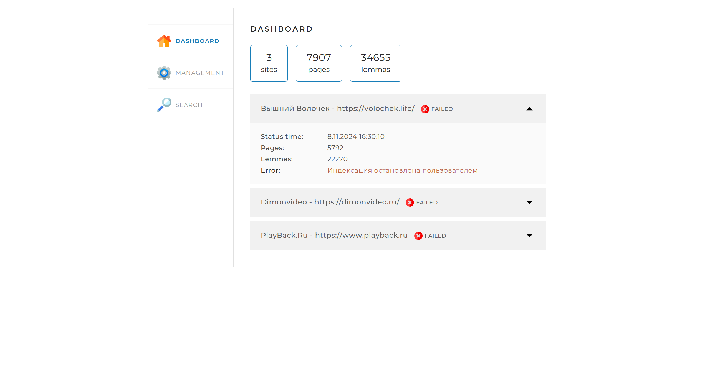
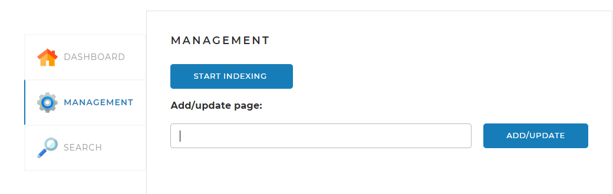
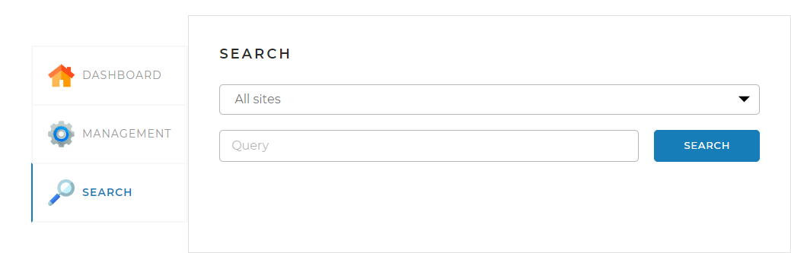
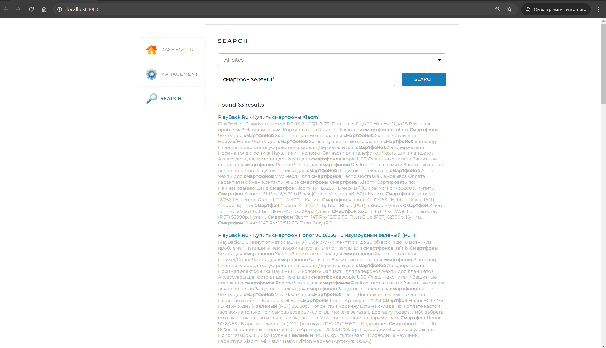

# Поисковой движок
Этот проект является системой для индексирования и поиска веб-страниц, построенной на Java и Spring Boot. Проект использует множество современных технологий и инструментов для обеспечения гибкости, масштабируемости и простоты в развертывании.

## Веб-страница
<p>
Частью проекта является веб-страница, предоставляющая возможность 
управления процессами.
<p>

Страница содержит три вкладки:
### Вкладка DASHBOARD 

 - Открывается по-умолчанию. В этой вкладке отображается общая статистика 
по всем проиндексированным сайтам, а также детальная статистика и статус
по каждому из сайтов (статистика, получаемая по запросу <i>/statistics</i>). 

    <p> <br/>

 - Отображение процесса индексации [INDEXING]. Для примера взяты сайты https://volochek.life, https://dimonvideo.ru, https://www.playback.ru.
 Для корректной работы приложения, необходимые для индексации сайты, нужно указать в конфигурационном файле _**application.yml**_. Путь к файлу: _**src/main/resources/application.yml**_.
<p> <br/>

 - Отображение выполненной индексации [INDEXED] с детальной статистикой.
     Пустое поле Error: говорит об отсутствии ошибок во время индексации сайта.
<p> 


 - Отображение остановки обхода сайтов [FAILED] с текстом ошибки в поле Error:
   «Индексация остановлена пользователем».
<p> <br/>

### Вкладка MANAGEMENT 
- На данной вкладке расположены средства управления поисковым движком,
  включая возможность запуска - нажатие
,
  либо через запрос **_/startIndexing_**. <br/>
  Остановить индексацию можно через запрос **_/stopIndexing_**. <br/>
  Для переиндексации необходимо ввести в поле Add/update page сайт,
  указанный в конфигурационном файле и нажать ,
  либо через запрос _**/indexPage/{pagePath}**_, где pagePath - адрес сайта
  для переиндексации. <br/>
<p>

### Вкладка SEARCH 
- На этой вкладке находятся инструменты управления поиском:
  в выпадающем списке есть возможность выбрать определенный сайт, либо оставить
  _**"All sites"**_ для поиска по всем ранее индексированным сайтам,
  ввести запросв поле _**Query**_ и начать поиск,
  нажав ,
  либо используя запрос /startIndexing.
  запрос _**/search?query=ЗАПРОС&offset=0&limit=10&site=САЙТ**_,
  где ЗАПРОС - интересующая вас информация,а САЙТ - адрес конкретного сайта,
  на котором вы хотите её найти(например, https://www.playback.ru).
  Если САЙТ не указан, поиск будет совершен по всем индексированным ранее сайтам.  
  <p> <br/>
- После выполнения поиска, вы получите сортированный по релевантности список
  ссылок.
<p> <br/>

## Настройки Spring Boot приложения
## Используемые технологии

### Java 17
Проект написан на языке программирования Java версии 17, который предоставляет все современные функции и возможности для разработки.

### Spring Boot
Мы используем Spring Boot версии 2.7.1, который помогает быстро и легко создавать современные Java-приложения.

Основные модули Spring Boot, которые используются:
- Spring Boot Starter Web: Для создания RESTful веб-сервисов и обработки HTTP-запросов.
- Spring Boot Starter Data JPA: Для взаимодействия с базой данных, используя ORM Hibernate.
- Spring Boot Starter Thymeleaf: Для поддержки серверной рендеринга HTML-шаблонов.

### Работа с базами данных
<p>
В настоящее время приложение сконфигурировано для взаимодействия с базой данных MySQL. База данных автоматически создается и обновляется с помощью 
Liquibase на основе классов из пакета src/main/java/searchengine/model. Основной файл миграции находится в classpath:db/changelog/db.changelog-master.xml

Мы также используем JPA для работы с базой данных через объектно-реляционное отображение (ORM).

### Конфигурация JPA
- ddl-auto: none

В текущей конфигурации схема базы данных не пересоздается автоматически при каждом запуске приложения, что гарантирует стабильность данных.

### Используемые зависимости и технологии

Приложение основано на платформе Spring Boot.
Необходимые компоненты собираются при помощи инструмента сборки Maven, который автоматически включает следующие стартеры и библиотеки:

- spring-boot-starter-web — предоставляет необходимые библиотеки для выполнения функций Spring MVC приложения и взаимодействия между клиентом и сервером через REST.

- spring-boot-starter-data-jpa — обеспечивает подключение к базе данных и работу с ней с использованием JPA и Hibernate.

- spring-boot-starter-thymeleaf — предоставляет функциональность для серверной шаблонизации веб-страниц с использованием Thymeleaf.

- org.apache.lucene.morphology и org.apache.lucene.analysis — используются для работы с лемматизацией текста.

- mysql-connector-java — драйвер для подключения и работы с базой данных MySQL.

- Liquibase — для управления миграциями базы данных, позволяя автоматизировать создание и обновление схемы.

- Jsoup — библиотека для скачивания и анализа HTML-страниц.

- Lombok — используется для сокращения шаблонного кода и повышения удобства разработки, предоставляя такие аннотации как @Getter, @Setter и @Slf4j.

### Docker и Docker Compose

Приложение использует Docker Compose для развертывания всей инфраструктуры (включая приложение и базу данных MySQL) в изолированной среде. 
Это упрощает настройку и развертывание.

### Запуск проекта

#### 1. Запуск через Docker Compose

Чтобы запустить приложение с помощью Docker Compose, выполните следующие шаги:

1. Клонируйте репозиторий и перейдите в директорию проекта.
2. Соберите проект с помощью Maven: ```mvn clean install```. 
3. Эта команда создаст .jar файл в папке target, необходимый для дальнейшего развертывания через Docker.
4. Выполните команду для сборки и запуска контейнеров:
```docker-compose up --build```. Эта команда создаст Docker-контейнеры для MySQL и вашего приложения.
5. После завершения сборки приложение будет доступно на ```http://localhost:8080```.

#### 2. Запуск без Docker Compose (через IntelliJ IDEA)
Для запуска проекта вручную, выполните следующие шаги:
1. Соберите проект с помощью Maven: ```mvn clean package```.
2. Запустите MySQL вручную на вашем компьютере. Убедитесь, что база данных настроена согласно параметрам в ```application.yml```:
- URL: ```jdbc:mysql://localhost:3306/search_engine```
- Имя пользователя: ```root```
- Пароль: ```Password123```
3. Запустите проект через IntelliJ IDEA. Найдите главный класс ```searchengine.Application``` и запустите его как Java-приложение. 
Приложение будет доступно по адресу ```http://localhost:8080```.

### Переменные окружения

В текущей конфигурации переменные окружения для подключения к базе данных используются в файле docker-compose.yml, 
но в application.yml эти параметры заданы статически, поэтому переменные среды фактически не применяются при локальном запуске проекта. 
Подключение к базе данных настраивается через параметры в файле application.yml.

### Заключение

Этот проект использует современные технологии и инструменты, чтобы предоставить мощное решение для индексирования и поиска информации с веб-страниц. 
Docker Compose упрощает развертывание и настройку инфраструктуры, а Spring Boot обеспечивает гибкость и производительность при создании веб-сервисов.
После успешного запуска приложения в среде разработки, для работы необходимо перейти по адресу: http://localhost:8080/